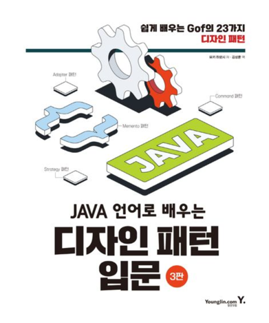

# JAVA 언어로 배우는 디자인패턴 입문 3판

## 책 소개

- **저자**: 유키 히로시
- **부제**: 쉽게 배우는 GoF의 23가지 디자인 패턴
- **출판**: 2022년 (3판)

GoF(Gang of Four)의 23가지 디자인 패턴을 Java 언어로 설명하는 입문서이다.
Java에 특화된 코드 없이 일반적인 OOP 코드를 사용하여 구체적인 예제를 중심으로 설명한다.
각 패턴마다 클래스 다이어그램, 시퀀스 다이어그램을 제시하고, 실행 가능한 코드로 작성하여 이해를 돕는다.

## 학습 목표

이 저장소는 위 책을 기반으로 디자인 패턴을 직접 구현하고 학습한 내용을 정리하는 프로젝트이다.
각 패턴별로 예제 코드를 작성하고, 핵심 개념을 문서로 정리한다.

## 구현 목록

| 패턴 | 설명 | 디렉토리 |
|------|------|----------|
| Iterator | 순서대로 지정해서 처리하기 | [iterator](src/main/java/iterator) |